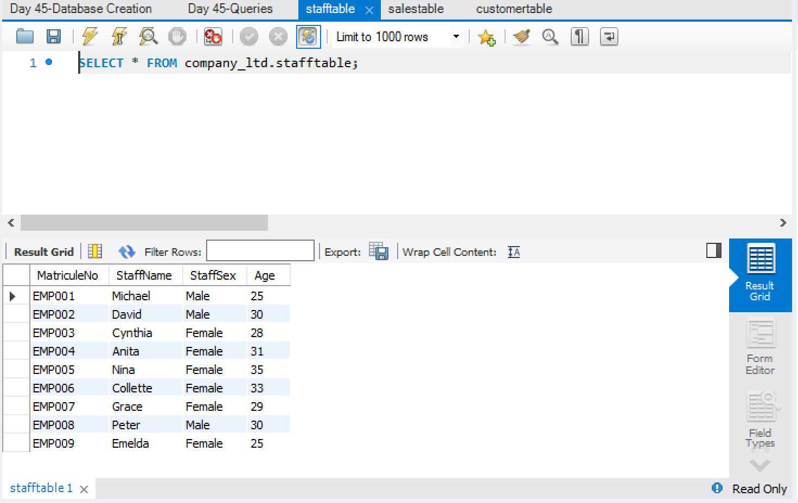
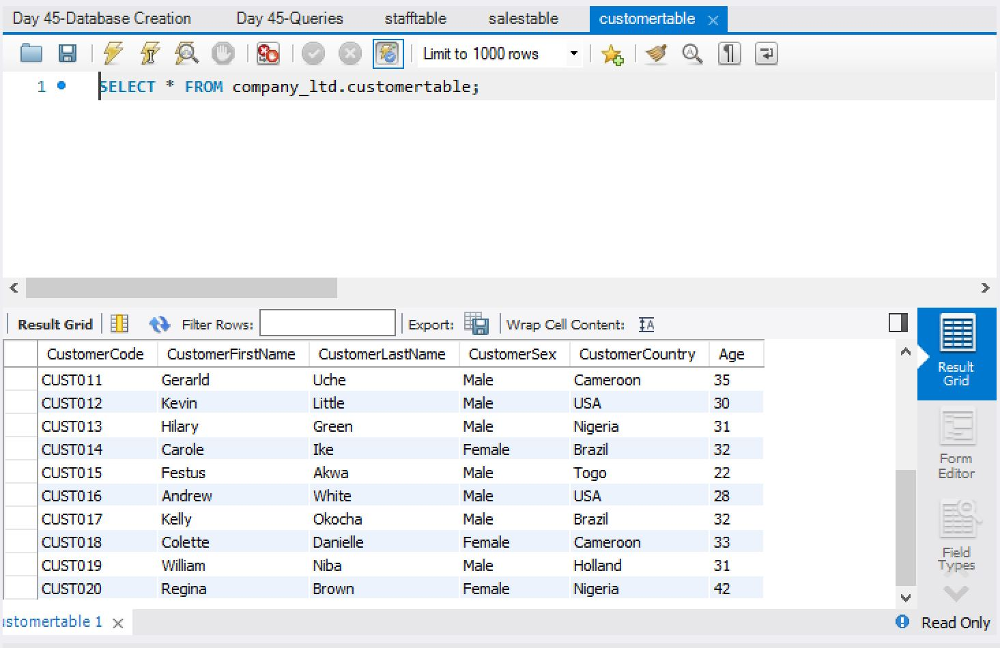
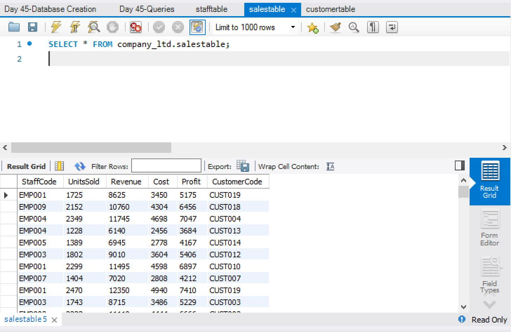
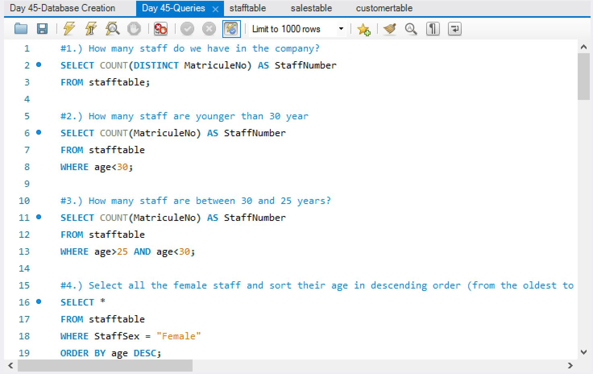

# 📊 Sales & Customer — Exploratory Data Analysis (SQL)

A SQL-based exploratory data analysis project that extracts actionable business insights from a company's staff, customer, and sales data. Queries cover workforce demographics, customer segmentation by geography, and multi-dimensional profit/revenue analysis across countries and staff members.

## 🛠️ Tech Stack

| Technology | Purpose |
|---|---|
| **MySQL** | Database Management System |
| **SQL** | Data querying & analysis |

## 📁 Project Structure

```
SQL-EDA-Project/
├── Database Creation.sql          # Schema + 700+ INSERT statements
├── Queries.sql                    # 18 analytical SQL queries
├── Information to be searched.txt # Business questions answered
├── Readme.md
└── images/                        # Table screenshots
```

## 🗃️ Database Schema

The database `company_ltd` consists of **3 normalized tables**:

### 1. Staff Table
Stores employee information — ID, name, gender, and age.



### 2. Customer Table
Stores customer demographics — name, gender, country, and age across **10+ countries**.



### 3. Sales Table
Stores transactional data — linked to both staff and customers via foreign keys, with revenue, cost, and profit fields.



## 🔍 Queries & Analysis

The project answers **18 business questions** organized into three categories:

### Staff Analysis
- Total headcount and age-based filtering (`COUNT`, `WHERE`)
- Gender-based sorting and average age computation (`ORDER BY`, `AVG`)

### Customer Analysis
- Customer segmentation by country and gender (`WHERE`, `IN`)
- Top-N oldest customers (`ORDER BY`, `LIMIT`)
- Average customer age per country (`GROUP BY`, `AVG`, `ROUND`)

### Cross-Table Sales Analysis (JOINs)
- Total profit and country-wise cost breakdowns using `INNER JOIN`
- Revenue per staff member via `JOIN` between sales and staff tables
- High-performing markets with 100+ transactions using `GROUP BY` + `HAVING`
- Staff-specific profit per country using multi-table `LEFT JOIN` with conditional aggregation



## 💡 Key SQL Concepts Demonstrated

- **Aggregations**: `SUM()`, `AVG()`, `COUNT()`, `ROUND()`
- **Filtering**: `WHERE`, `HAVING`, `IN`, `AND/OR`
- **Joins**: `INNER JOIN`, `LEFT JOIN` (multi-table)
- **Sorting & Limiting**: `ORDER BY ASC/DESC`, `LIMIT`
- **Grouping**: `GROUP BY` with single and multiple columns
- **Aliasing**: Column and table aliases for readability

## 🚀 Getting Started

### Prerequisites
- MySQL 5.7+ or MySQL Workbench

### Setup
1. Clone the repository:
   ```bash
   git clone https://github.com/YourUsername/SQL-EDA-Project.git
   ```
2. Open MySQL Workbench (or any MySQL client).
3. Run `Database Creation.sql` to create the database, tables, and insert all data.
4. Run the queries in `Queries.sql` to explore the data.

## 📄 License

This project is open source and available for learning purposes.
